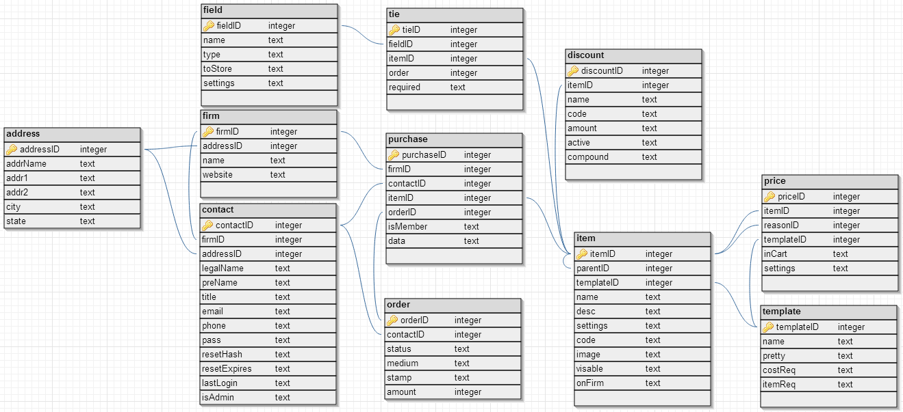

These docs are related to the release [0.3.00](https://github.com/bign8-AZ/UA-purchasing-system/releases/tag/0.3.00). Any other versions and this may be outdated or obsolete.

## Database System: SQLite3

Using PhP's implementation of SQLite3 via PDO connections, provides programmers with the ability to have full development and production environments without the needs for extra database servers.  This emerging standard also simplifies database management because instead of requiring any servers, it holds all database information within a single file.

> SQLite is a software library that implements a self-contained, server-less, zero-configuration, transactional SQL database engine.
> SQLite is the most widely deployed SQL database engine in the world.
> The source code for SQLite is in the public domain.  
> &mdash; [SQLite.org](http://www.sqlite.org/ "Small. Fast. Reliable.")

## Management Interface: phpLiteAdmin

In searching for a replacement of phpMyAdmin, I found phpLiteAdmin.  This single file database management is located at `/libinc/phpmyadmin.php` relative to your build location.  Currently the password is defined in `/libinc/phpmyadmin.config.php` but eventually, it should be moved to `/libinc/config.php`.

The source code has been modified in a few places denoted by `// nate added` which are described below.

1. Supporting Foreign Keys
2. Properly displaying `Create Table` queries

> phpLiteAdmin is a web-based SQLite database admin tool written in PHP with support for SQLite2 and SQLite3.
> Following in the spirit of the flat-file system used by SQLite,
> phpLiteAdmin consists of a single source file, phpliteadmin.php,
> that is dropped into a directory on a server and then visited in a browser.
> There is no installation required.
> The available operations, feature set, interface, and user experience is comparable to that of phpMyAdmin.  
> &mdash; [Code.Google.com/p/phpLiteAdmin/](https://code.google.com/p/phpliteadmin/)

## Database Schema

### Overview

&mdash; [Source](http://dbdsgnr.appspot.com/)

---
### <a name="address" href="#address">Address</a>
Field     | Type    | Not Null | Default | Comments
--------- | ------- | -------- | ------- | --------
addressID | Integer | Yes      | *None*  | Primary Key / Auto Increment
addrName  | Text    | Yes      | ''      | 
addr1     | Text    | Yes      | *None*  | 
addr2     | Text    | Yes      | ''      | 
city      | Text    | Yes      | *None*  | 
state     | Text    | Yes      | *None*  | 

---
### <a name="contact" href="#contact">Contact</a>
Field        | Type     | Not Null | Default           | Comments
------------ | -------- | -------- | ----------------- | --------
contactID    | Integer  | Yes      | *None*            | Primary Key / Auto Increment
firmID       | INTEGER  | Yes      | *None*            | [`firm(firmID)`](#firm) *C*
addressID    | INTEGER  | No       | *NULL*            | [`address(addressID)`](#address) *N*
legalName    | TEXT     | Yes      | *None*            | 
preName      | TEXT     | No       | *NULL*            | 
title        | TEXT     | Yes      | *None*            | 
email        | TEXT     | Yes      | *None*            | 
phone        | TEXT     | Yes      | *None*            | 
pass         | TEXT     | No       | *NULL*            | 
resetHash    | TEXT     | No       | *NULL*            | 
resetExpires | DATETIME | No       | *NULL*            | 
lastLogin    | DATETIME | Yes      | CURRENT_TIMESTAMP | 
isAdmin      | BOOLEAN  | Yes      | 'false'           | 

---
### <a name="discount" href="#discount">Discount</a>
Field      | Type    | Not Null | Default | Comments
---------- | ------- | -------- | ------- | --------
discountID | INTEGER | Yes      | *None*  | Primary Key / Auto Increment
itemID     | INTEGER | No       | *NULL*  | [`item(itemID)`](#item) *C*
name       | TEXT    | Yes      | *None*  | 
code       | TEXT    | Yes      | *None*  | 
amount     | INTEGER | Yes      | '0'     | 
active     | BOOLEAN | Yes      | 'true'  | 
compound   | BOOLEAN | Yes      | 'false' | 

---
### <a name="field" href="#field">Field</a>
Field    | Type    | Not Null | Default | Comments
-------- | ------- | -------- | ------- | --------
fieldID  | INTEGER | Yes      | *None*  | Primary Key / Auto Increment
name     | TEXT    | Yes      | *None*  | 
type     | TEXT    | Yes      | *None*  | 
toStore  | BOOLEAN | Yes      | 'true'  | 
settings | TEXT    | Yes      | *None*  | 

---
### <a name="firm" href="#firm">Firm</a>
Field     | Type    | Not Null | Default | Comments
--------- | ------- | -------- | ------- | --------
firmID    | INTEGER | Yes      | *None*  | Primary Key / Auto Increment
addressID | INTEGER | No       | *NULL*  | [`address(addressID)`](#address) *N*
name      | TEXT    | Yes      | *None*  | 
website   | TEXT    | Yes      | *None*  | 

---
### <a name="item" href="#item">Item</a>
Field      | Type    | Not Null | Default | Comments
---------- | ------- | -------- | ------- | --------
itemID     | INTEGER | Yes      | *None*  | Primary Key / Auto Increment
parentID   | INTEGER | No       | *NULL*  | [`item(itemID)`](#item) *C*
templateID | INTEGER | No       | *None*  | [`template(templateID)`](#template) *R*
name       | TEXT    | Yes      | *None*  | 
desc       | TEXT    | Yes      | *None*  | 
settings   | TEXT    | Yes      | *None*  | 
code       | TEXT    | No       | *NULL*  | 
image      | TEXT    | No       | *NULL*  | 
visable    | BOOLEAN | Yes      | 'true'  | 
onFirm     | BOOLEAN | Yes      | 'true'  | 

---
### <a name="order" href="#order">Order</a>
Field     | Type      | Not Null | Default           | Comments
--------- | --------- | -------- | ----------------- | --------
orderID   | INTEGER   | Yes      | *None*            | Primary Key / Auto Increment
contactID | INTEGER   | No       | *NULL*            | [`contact(contactID)`](#contact) *N*
status    | TEXT      | Yes      | 'pending'         | 
medium    | TEXT NNOT | No       | *None*            | 
stamp     | DATETIME  | Yes      | CURRENT_TIMESTAMP | 
amount    | INTEGER   | Yes      | *None*            | 

---
### <a name="price" href="#price">Price</a>
Field      | Type    | Not Null | Default | Comments
---------- | ------- | -------- | ------- | --------
priceID    | INTEGER | Yes      | *None*  | Primary Key / Auto Increment
itemID     | INTEGER | Yes      | *None*  | [`item(itemID)`](#item) *C*
reasonID   | INTEGER | No       | *NULL*  | [`item(itemID)`](#item) *C*
inCart     | BOOLEAN | Yes      | 'true'  | 
templateID | INTEGER | No       | *NULL*  | 
settings   | TEXT    | Yes      | *None*  | 

---
### <a name="purchase" href="#purchase">Purchase</a>
Field      | Type    | Not Null | Default | Comments
---------- | ------- | -------- | ------- | --------
purchaseID | INTEGER | Yes      | *None*  | Primary Key / Auto Increment
contactID  | INTEGER | No       | *NULL*  | [`contact(contactID)`](#contact) *C*
firmID     | INTEGER | No       | *NULL*  | [`firm(firmID)`](#firm) *C*
itemID     | INTEGER | Yes      | *None*  | [`item(itemID)`](#item) *C*
orderID    | INTEGER | No       | *NULL*  | [`order(orderID)`](#order) *C*
isMember   | BOOLEAN | Yes      | 'false' | 
data       | TEXT    | No       | *None*  | 

---
### <a name="template" href="#template">Template</a>
Field      | Type    | Not Null | Default | Comments
---------- | ------- | -------- | ------- | --------
templateID | INTEGER | Yes      | *None*  | Primary Key / Auto Increment
name       | TEXT    | Yes      | *None*  | 
pretty     | TEXT    | Yes      | *None*  | 
costReq    | TEXT    | Yes      | *None*  | 
itemReq    | TEXT    | Yes      | *None*  | 

---
### <a name="tie" href="#tie">Tie</a>
Field      | Type    | Not Null | Default | Comments
---------- | ------- | -------- | ------- | --------
tieID      | INTEGER | Yes      | *None*  | Primary Key / Auto Increment
fieldID    | INTEGER | Yes      | *None*  | [`field(fieldID)`](#field) *C*
itemID     | INTEGER | Yes      | *None*  | [`item(itemID)`](#item) *C*
order      | INTEGER | Yes      | *None*  | 
required   | BOOLEAN | Yes      | 'false' | 

---
## Index + Notes

* All Foreign keys are set to `CASCADE` on UPDATE.
* Comments
	- [`tie(tieID)`](#tie): References `tieID` on `tie` table
	- Reference followed by one of the following defines on DELETE behavior.
		+ *C*: `CASCADE`
		+ *N*: `SET NULL`
		+ *R*: `RESTRICT`

